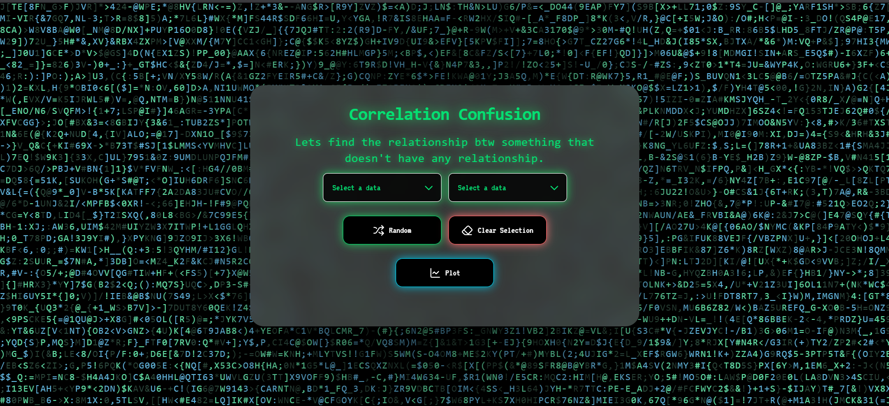
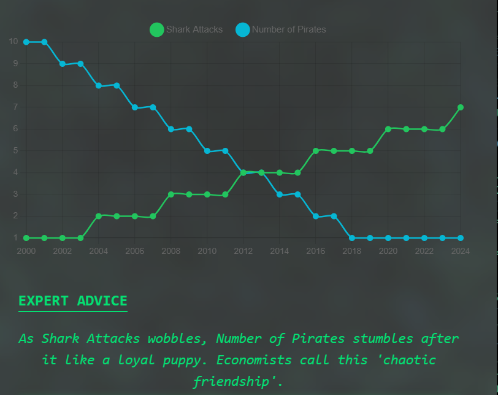
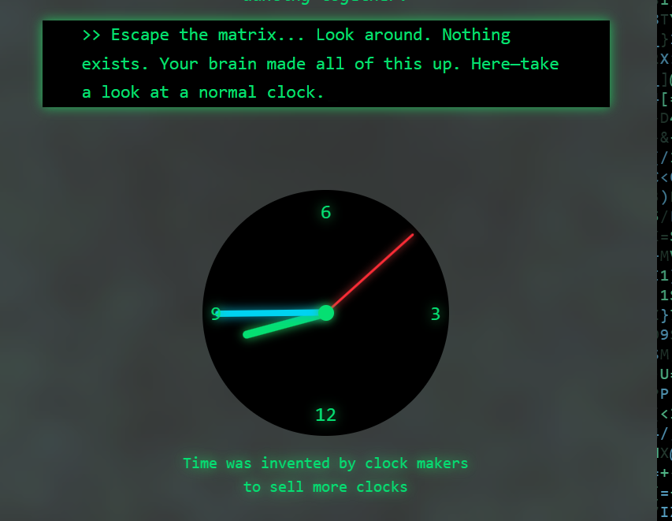

# Correlation Confusion Plotter

Correlation Confusion Plotter is a fun and interactive web app that lets you pick any two random datasets and visualize them together to find patterns that don’t actually exist. The goal is to humorously highlight spurious correlations by generating random plots and absurd expert advice based on the selected datasets.

## Basic Details
### Team Name: Trade Jacks


### Team Members
- Team Lead: Farzan R S - RIT KOTTAYAM
- Member 2: Nil
- Member 3: Nil

### Project Description
Correlation Confusion Plotter is a playful web app that lets users pick any two random inbuilt datasets, visualize them, and hilariously highlight spurious correlations with absurd expert advice .

### The Problem (that doesn't exist)
People tend to find patterns in totally unrelated things like the golden ratio in random images etc! I took this seriousliy and decided to plot something totally unrelated and add an expert advice

### The Solution (that nobody asked for)
We solve this by plotting two unrelated datasets together and generating absurd expert interpretations. This leads us to absurd examples like as ufo sightings decreased the amount of divroce rates increased and sone

## Technical Details
### Technologies/Components Used
For Software:
- Javascript
- React 18, Vite
- TailwindCSS, Lucide React, React Simple Typewriter,React Bits(for generation of background)
- Webstorm,Github,Npm

For Hardware: Nil

---

### Implementation

### For Software:

# Installation

``` bash

git clone https://github.com/F7Z7/Correlation-Confusion-Useless-Projects-.git
cd correlation-confusion-useless-projects
npm install
````
---
## Run
````bash

 npm run dev
````
Open your browser at http://localhost:5173
---
## ScreenShots
 Homepage with dataset selection dropdowns.
 Example of an absurd correlation with generated expert advice.
Outro with typewriter text and twist clock that moves backwards for a quirky finish


### ✨ Features

Select two datasets from a predefined list.

Random selection button to instantly choose two random datasets.

Interactive line/scatter plot visualization of the selected data.

Absurd expert advice generated automatically for your chosen datasets.

Typewriter outro with a twist clock for a quirky finish.

Fully responsive UI with smooth styling using TailwindCSS and React components.

### 📂 Project Structure

```
📦 
├─ .gitignore
├─ README.md
├─ eslint.config.js
├─ index.html
├─ package-lock.json
├─ package.json
├─ public
│  └─ favicon_image.png
├─ src
│  ├─ App.css
│  ├─ App.jsx
│  ├─ Datas
│  │  ├─ ComboDatas.jsx
│  │  └─ utils
│  │     └─ generateAbsurdJoke.js
│  ├─ Pages
│  │  ├─ Hero.jsx
│  │  └─ NotFound.jsx
│  ├─ components
│  │  ├─ Button.jsx
│  │  ├─ ChartComponent.jsx
│  │  ├─ ComboBox.jsx
│  │  ├─ Header.jsx
│  │  ├─ LetterGlitch.jsx
│  │  ├─ OutroText.jsx
│  │  ├─ SubHeadings.jsx
│  │  └─ TwistClock.jsx
│  ├─ index.css
│  └─ main.jsx
└─ vite.config.js
```

- Datas: Contains some  logic for generating absurd expert advice.

- Pages: Includes the main Hero section and NotFound page.

- Components: UI components for buttons, charts, combo boxes, headers, typewriter effects, and clocks.

- Public: Contains the favicon and any static assets.

### 🚀 Getting Started

Follow these steps to clone, install, and run the project locally:

1️⃣ Clone the repository

git clone [https://github.com/your-username/correlation-confusion-plotter.git]

cd correlation-confusion-plotter

2️⃣ Install dependencies

npm install

3️⃣ Run the development server

npm run dev

The app will be available at http://localhost:5173 (Vite default).

4️⃣ Build for production

npm run build

This will generate optimized static files in the dist folder.

### 🛠 Tech Stack

- React 18 + Vite – Frontend framework and fast bundler

- TailwindCSS – Styling and responsive design

- Lucide React – Icons

- React Simple Typewriter – Typewriter animation

- Custom Components – Interactive charting and UI elements

### 💡 Example Usage

- Open the app.

- Select two datasets from the dropdown menus, or click Random.

- Click Plot to visualize the datasets.

- Read the absurd expert advice and enjoy the typewriter outro!

- Click Clear Selection to start again.

### 🤝 Contributing

Feel free to fork this repository, open issues, or submit pull requests with new datasets, features, or fun ideas!

### 📜 License

This project is licensed under the MIT License.

Made with ❤️ and a bit of dopamine by F7Z7.

